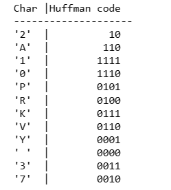

# HUFFMAN CODING
## AIM:
To implement Huffman coding to compress the data using Python.

## SOFTWARE REQUIRED:
Anaconda - Python 3.7

## ALGORITHM:
### STEP 1:
Get the input String.

### STEP 2:
Create tree nodes.

### STEP 3:
Main function to implement huffman coding.

### STEP 4:
Calculate frequency of occurrence.

### STEP 5:
Print the characters and its huffman code.
 
## PROGRAM:
```
NAME : PAARKAVY B
REG NO : 212221230072
```

```
# Get the input String
string = 'PAARKAVY 212221230072'

# Create tree nodes
class NodeTree(object):
    def __init__(a,left=None,right=None):
        a.left=left
        a.right=right
    def children(a):
        return(a.left,a.right)

# Main function to implement huffman coding
def huffman_code_tree(node,left=True,binString=''):
    if type(node) is str:
        return {node:binString}
    (l,r)=node.children()
    d=dict()
    d.update(huffman_code_tree(l,True,binString+'0'))
    d.update(huffman_code_tree(r,False,binString+'1'))
    return d

# Calculate frequency of occurrence
freq={}
for c in string:
    if c in freq:
        freq[c]+=1
    else:
        freq[c]=1
freq=sorted(freq.items(),key=lambda x:x[1],reverse=True)
nodes=freq

while len(nodes)>1:
    (key1,c1)=nodes[-1]
    (key2,c2)=nodes[-2]
    nodes=nodes[:-2]
    node=NodeTree(key1,key2)
    nodes.append((node,c1+c2))
    nodes=sorted(nodes,key=lambda x:x[1],reverse=True)

# Print the characters and its huffman code
huffmanCode=huffman_code_tree(nodes[0][0])
print('Char |Huffman code ')
print('--------------------')
for(char,frequency) in freq:
    print('%-4r |%12s'%(char,huffmanCode[char]))
```
## OUTPUT:
### PRINT THE CHARACTERS AND ITS HUFFMAN CODE


## RESULT:
Thus the huffman coding was implemented to compress the data using python programming.